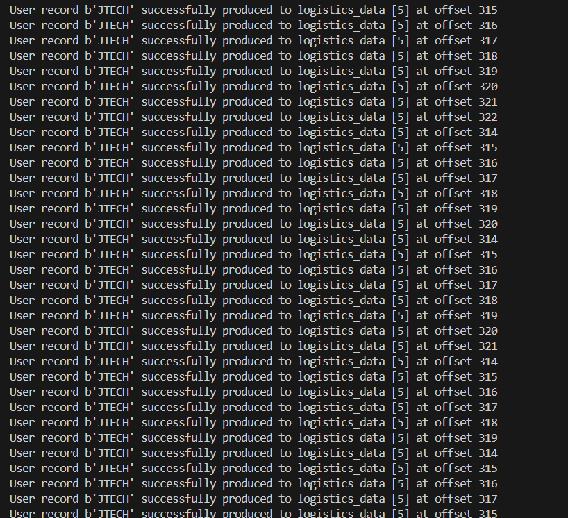
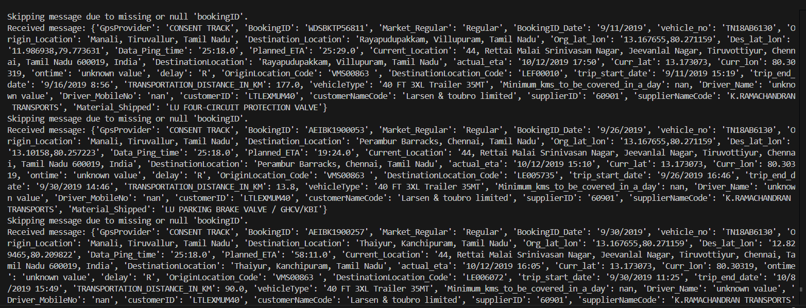
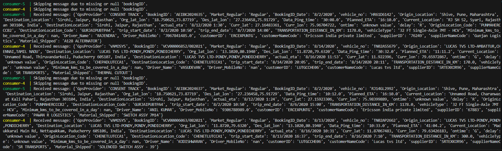
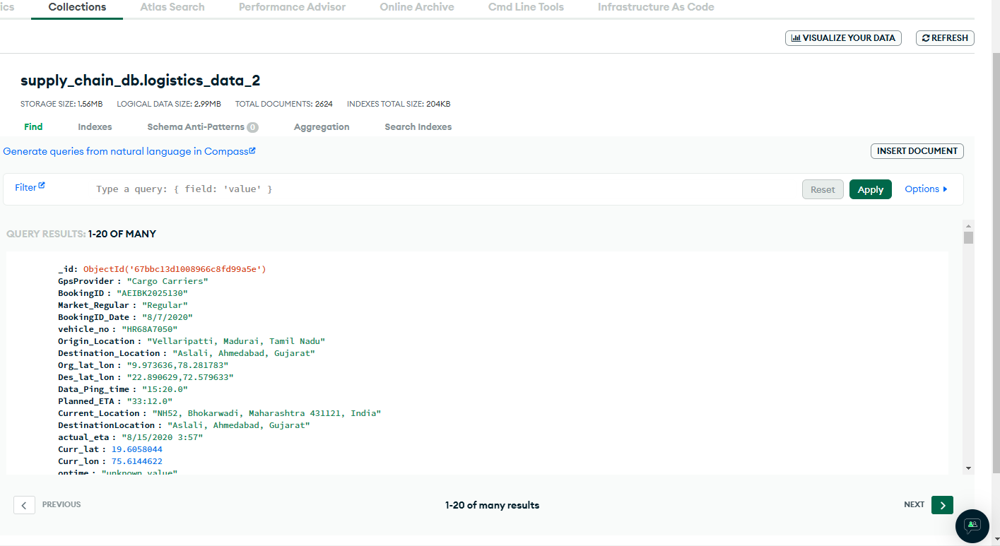
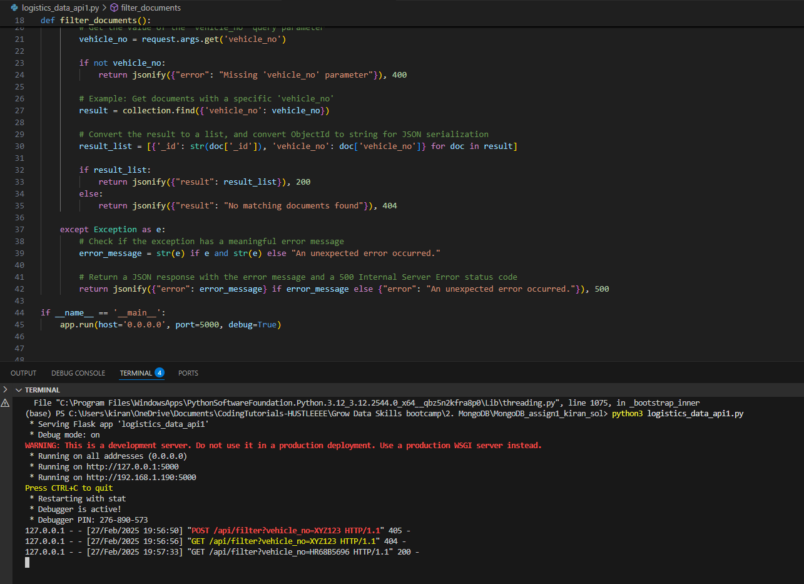
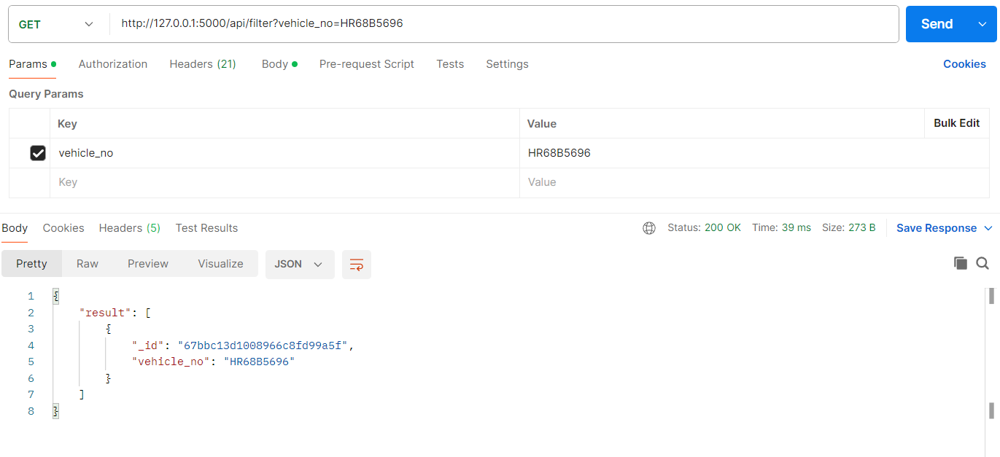
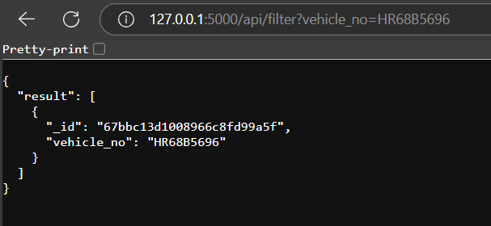
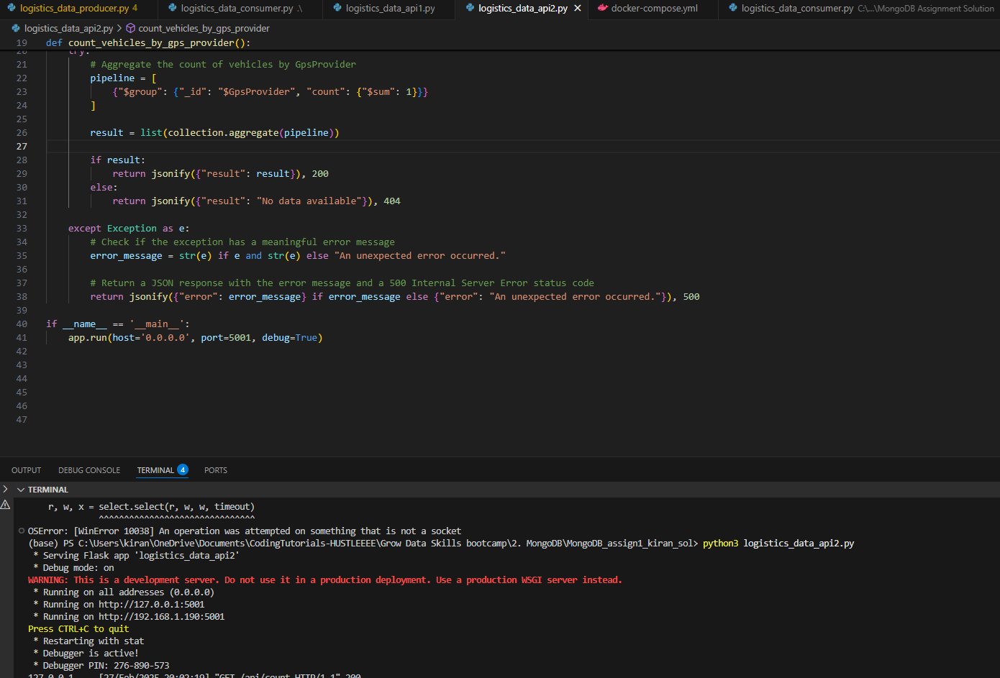
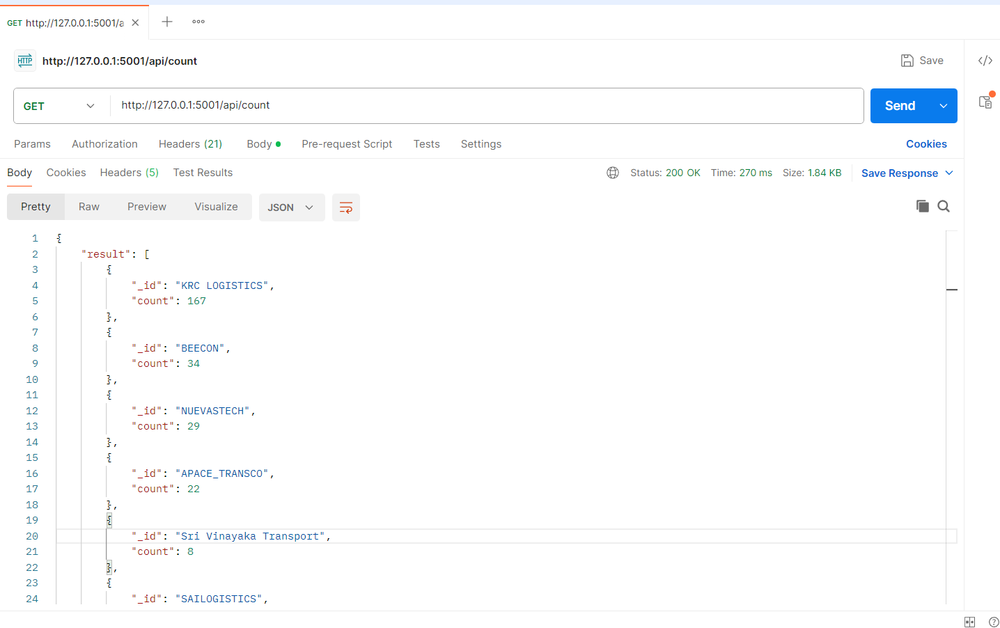
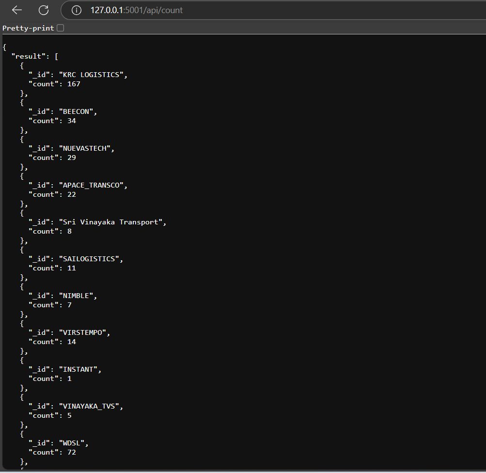

# Real-Time Logistics Data Processing with Kafka, MongoDB, Flask, and Docker

## Overview
This project involves real-time data streaming and storage using Kafka, MongoDB, and Flask APIs. The data pipeline consists of:
- A **producer** that fetches data from a CSV file and sends it to a Kafka topic.
- A **consumer** that processes and stores the data in MongoDB.
- **Flask APIs** to retrieve and analyze the stored data.

## Tools Used
- Python 3
- Confluent Kafka
- Jupyter Notebook
- Postman
- MongoDB Atlas
- MongoDB Compass
- Flask
- Docker

## Files Included
1. `delivery_trip_truck_data.csv` – Raw data used to push to the Kafka topic.
2. `logistics_data_producer.py` – Python script for the Kafka producer.
3. `logistics_data_consumer.py` – Python script for the Kafka consumer.
4. `logistics_data_api1.py` – Flask API to filter documents based on vehicle number from MongoDB.
5. `logistics_data_api2.py` – Flask API to count vehicle numbers grouped by `GpsProvider`.
6. `Dockerfile.txt` – Dockerfile to build a Docker image.
7. `docker-compose.yml` – YAML file to configure and run Kafka, MongoDB, and consumers.

## Project Workflow

### Step 1: Kafka Topic Creation
- Created a Kafka topic named `logistics_data` with 6 partitions.
- Defined an appropriate schema for data ingestion.
- Replaced missing values (NaN) with 'unknown value' for string fields.

### Step 2: Kafka Producer
- Implemented `logistics_data_producer.py` to fetch data from the CSV file.
- Serialized data into Avro format.
- Used `GpsProvider` field as the partition key.
- Successfully published messages to the Kafka topic.

### Step 3: MongoDB Database Setup
- Created a MongoDB database `supply_chain_db`.
- Created an empty collection `logistics_data` to store streamed data.

### Step 4: Kafka Consumer
- Implemented `logistics_data_consumer.py` to:
  - Deserialize Avro data.
  - Perform data validation checks (null handling, data types, format validation).
  - Avoid duplicate records before inserting them into MongoDB.

consumer.py output:

### Step 5: Scaling with Docker
- Created a `Dockerfile` to define dependencies.
- Used `docker-compose.yml` to:
  - Configure Kafka, MongoDB, and consumers.
  - Set up 3 parallel consumer instances for better scalability.

three consumers scaled using docker output:

data stored in mongodb screenshot:

### Step 6: Flask API Implementation
- `logistics_data_api1.py`: Fetches a specific document using `vehicle_no`.  
  Example: `/api/filter?vehicle_no=XYZ1234`
  api-1 outputs:
  

- `logistics_data_api2.py`: Aggregates and returns count of vehicles by `GpsProvider`.
- api-2 outputs:
  

**APIs were tested using Postman and browser.**

## Running the Project

### 1. Start Kafka and MongoDB
Ensure Docker is installed, then run:
docker-compose up -d

### 2. Start Producer
python logistics_data_producer.py

### 3. Start Consumers
docker-compose up --scale consumer=3

### 4. Run Flask APIs
python logistics_data_api1.py
python logistics_data_api2.py

### 5. Test APIs
Use Postman or a browser to verify API responses.

## Verifying Data

- Check MongoDB data using MongoDB Compass. 
- Validate API responses in Postman.

## Future Improvements

- 'Replace Flask with FastAPI': 'Flask' was chosen due to familiarity, but 'FastAPI' would improve performance, provide built-in data validation, and offer automatic API documentation.
- 'Implement Authentication': Add authentication and authorization mechanisms to secure API endpoints.
- 'Enhance Data Processing': Use 'Apache Spark' for batch processing and more advanced analytics.
- 'Deploy on Cloud': Deploy Kafka, MongoDB, and APIs using 'Kubernetes' on a cloud provider like 'AWS' or 'Azure' for scalability.
- 'Add Monitoring': Use 'Prometheus' and 'Grafana' to monitor Kafka topics, consumer lag, and API performance.
  
## Conclusion

This project successfully demonstrates real-time data streaming with Kafka, MongoDB, and Flask APIs, integrating scalable consumer architecture using Docker and Kafka partitions.

### Notes:

- **Screenshot placeholders**: Replace the `path/to/screenshotX.png` with the actual paths to your screenshots.
- **File paths**: If using local directories or GitHub, ensure the paths are correct or hosted on a cloud storage service.
- **Testing and API details**: You can add more information on the API responses or specific testing steps with Postman if needed.
